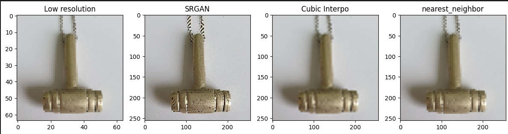

# Super-Resolution GAN for Image Upscaling
## Project Overview
This project focuses on the application of Generative Adversarial Networks (GANs) to upscale low-resolution images into high-resolution counterparts. Using a dataset of 30 low-resolution images (each 64x64 pixels), the challenge is to produce 256x256 pixel high-resolution versions. This involves generating new pixels to fill in details that were not present in the original images, effectively increasing the image size by a factor of 16.

## Objective
The primary goal is to develop a model capable of performing photo-realistic super-resolution on images. We leverage the state-of-the-art technique known as Photo-Realistic Single Image Super-Resolution using a Generative Adversarial Network (GAN), which excels in creating high-quality approximations of what an image might look like at a higher resolution. This approach provides an excellent introduction to GANs, a revolutionary concept in AI and machine learning.

## Image Upsampling Methods
The project compares traditional image upsampling techniques, such as nearest neighbor and bicubic interpolation, with neural super-resolution methods. Unlike standard upsampling, which often results in blurry or pixelated images, neural super-resolution aims to generate a high-quality approximation of the high-resolution image.

## The Super-Resolution Generative Adversarial Network (SRGAN)
At the heart of our approach is the SRGAN model, consisting of a Generator network that upscales images and a Discriminator network that evaluates the realism of the upscaled images. The interaction between these networks drives the improvement in image quality, aiming for super-resolved images that are indistinguishable from real high-resolution photos.

## Results

## References
SegFormer: Simple and Efficient Design for Semantic Segmentation with Transformers