# Super-Resolution GAN for Image Upscaling
## Project Overview
This project focuses on the application of Generative Adversarial Networks (GANs) to upscale low-resolution images into high-resolution counterparts. Using a dataset of 30 low-resolution images (each 64x64 pixels), the challenge is to produce 256x256 pixel high-resolution versions. This involves generating new pixels to fill in details that were not present in the original images, effectively increasing the image size by a factor of 16.

## Contents

[***Objective***](https://github.com/Joywessim/GAN-Upscale.git#objective)

[***Concepts***](https://github.com/Joywessim/GAN-Upscale.git#concepts)

[***Overview***](https://github.com/Joywessim/GAN-Upscale.git#overview)

## Results

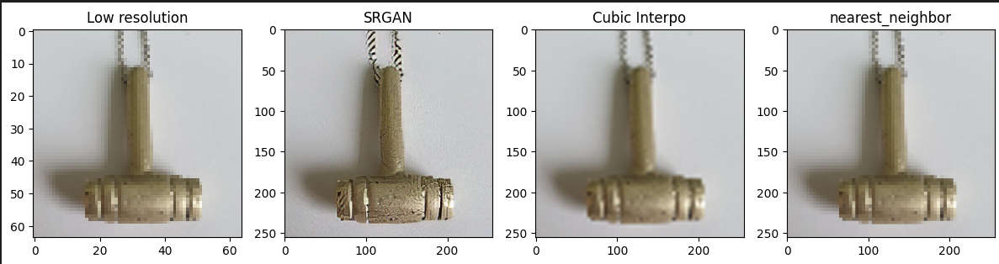

## Objective

**To build a model that can realistically increase image resolution.**

Super-resolution (SR) models essentially hallucinate new pixels where previously there were none. In this tutorial, we will try to _quadruple_ the dimensions of an image i.e. increase the number of pixels by 16x!

We're going to be implementing [_Photo-Realistic Single Image Super-Resolution Using a Generative Adversarial Network_](https://arxiv.org/abs/1609.04802). It's not just that the results are very impressive... it's also a great introduction to GANs!

We will train the two models described in the paper — the SRResNet, and the SRGAN which greatly improves upon the former through adversarial training.  

Before you proceed, take a look at some examples generated from low-resolution images not seen during training. _Enhance!_

## Concepts

* **Super-Resolution**. duh.

* **Residual Connections**. Introduced in the [seminal 2015 paper](https://arxiv.org/abs/1512.03385), residual connections are shortcuts over one or many neural network layers that allow them to learn residual mappings – perturbations to the input that produce the desired output – instead of wholly learning the output itself. Adding these connections, across so-called residual "blocks", greatly increases the optimizability of very deep neural networks. 
  
* **Generative Adversarial Network (GAN)**. From [another groundbreaking paper](https://proceedings.neurips.cc/paper/2014/file/5ca3e9b122f61f8f06494c97b1afccf3-Paper.pdf), GANs are a machine learning framework that pits two networks against each other, i.e., as adversaries. A generative model, called the Generator, seeks to produce some data – in this case, images of a higher resolution – that is identical in its distribution to the training data. A discriminating model, called the Discriminator, seeks to thwart its attempts at forgery by learning to tell real from fake. As either network grows more skilled, its predictions can be used to improve the other. Ultimately, we want the Generator's fictions to be indistinguishable from fact – at least to the human eye.

* **Sub-Pixel Convolution**. An alternative to transposed convolutions commonly used for upscaling images, subpixel convolutions use regular convolutions on lower-resolution feature maps to create new pixels in the form of new image channels, which are then "shuffled" into a higher-resolution image. 
  
* **Perceptual Loss**. This combines MSE-based content loss in a "deep" image space, as opposed to the usual RGB channel-space, and the adversarial loss, which allows the Generator to learn from the rulings of the Discriminator.

## Overview

In this section, I will present an overview of this model.

### Image Upsampling Methods

Image upsampling is basically the process of **artificially increasing its spatial resolution** – the number of pixels that represent the "view" contained in the image. 

**Upsampling an image is a very common application** – it's happening each time you pinch-zoom into an image on your phone or watch a 480p video on your 1080p monitor. You'd be right that there's no AI involved, and you can tell because the image will begin to appear blurry or blocky once you view it at a resolution greater than that it was encoded at. 

Unlike the neural super-resolution that we will attempt in this tutorial, common upsampling methods are not intended to produce high-fidelity estimations of what an image would look like at higher resolution. Rather, they are used because **images constantly need to be resampled in order to display them**. When you want an image to occupy a certain portion of a 1080p screen or be printed to fit A4-sized paper, for example, it'd be a hell of a coincidence if the native resolution of the monitor or printer matched the resolution of the image. While upsampling technically increases the resolution, it remains obvious that it is still effectively a low-resolution, low-detail image that is simply being viewed at a higher resolution, possibly with some smoothing or sharpening.

In fact, images upsampled with these methods can be used as a **proxy for the low-resolution image** to compare with their super-resolved versions both in the paper and in this tutorial. It would be impossible to display a low-resolution image at the same physical size (in inches, on your screen) as the super-resolved image without upsampling it in some way (or downsampling the super-resolved image, which is stupid). 

Let's take a look at some **common upsampling techniques**, shall we?

As a reference image, consider this awesome Samurai logo from *Cyberpunk 2077* [created by Reddit user /u/shapanga](https://reddit.com/r/cyberpunkgame/comments/8rnndi/i_remade_the_jacket_logo_from_the_trailer_feel/), which I'm using here with their permission.

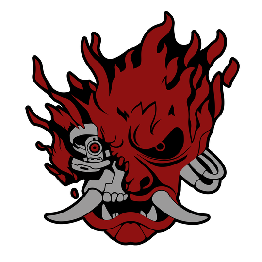

Consider the same image at quarter dimensions, or sixteen times fewer pixels.

The goal is to increase the number of pixels in this low-resolution image so it can be displayed at the same size as its high-resolution counterpart. 

#### Nearest Neighbour Upsampling

This is the simplest way to upsample an image and essentially amounts to stretching the image as-is. 

Consider a small image with a black diagonal line, with red on one side and gray on the other.

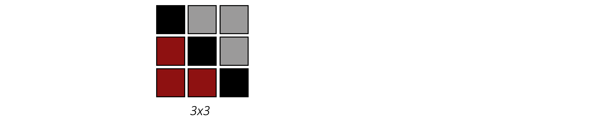

We first create new, empty pixels between known pixels at the desired resolution.

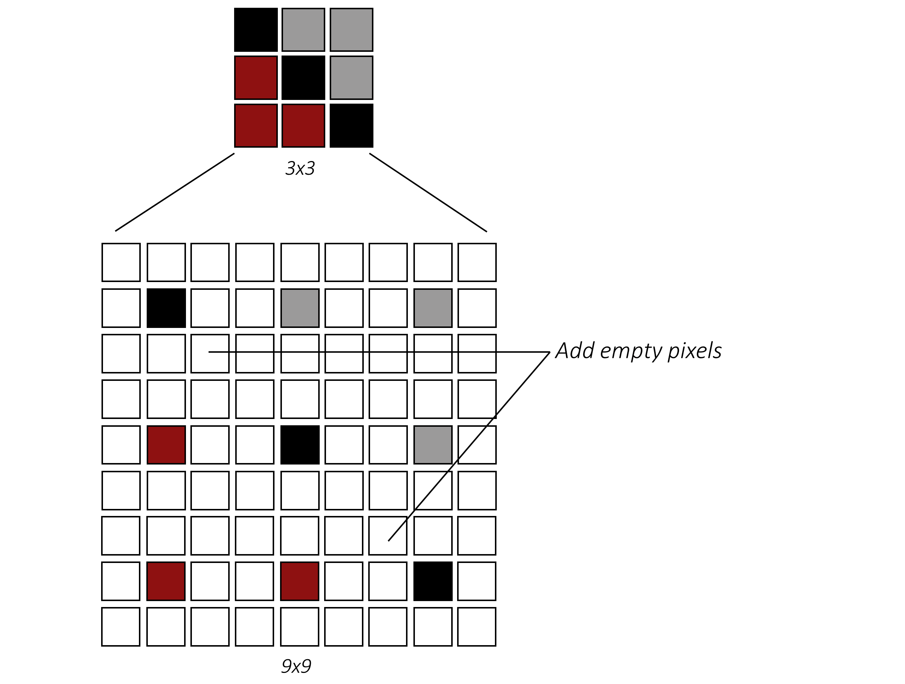

We then assign each new pixel the **value of its nearest neighbor** whose value we _do_ know.

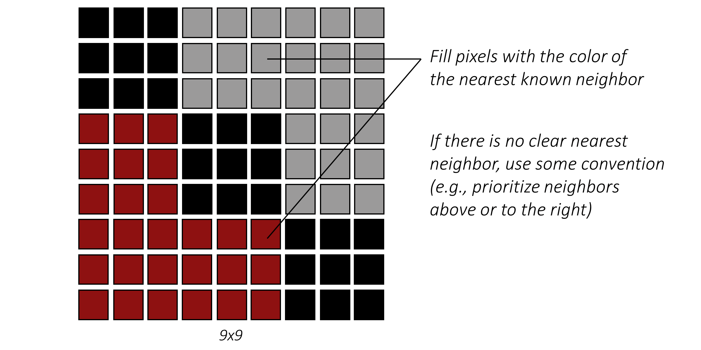

Upsampling the low-resolution Samurai image using nearest neighbor interpolation yields a result that appears blocky and contains jagged edges. 

#### Bilinear / Bicubic Upsampling

Here too, we create empty pixels such that the image is at the target resolution.

These pixels must now be painted in. If we perform linear interpolation using the two closest known pixels (i.e., one on each side), it is **_bilinear_ upsampling**.

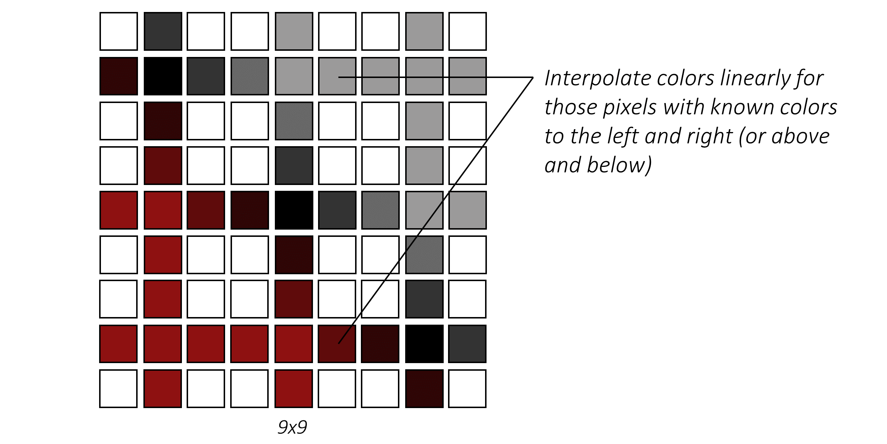

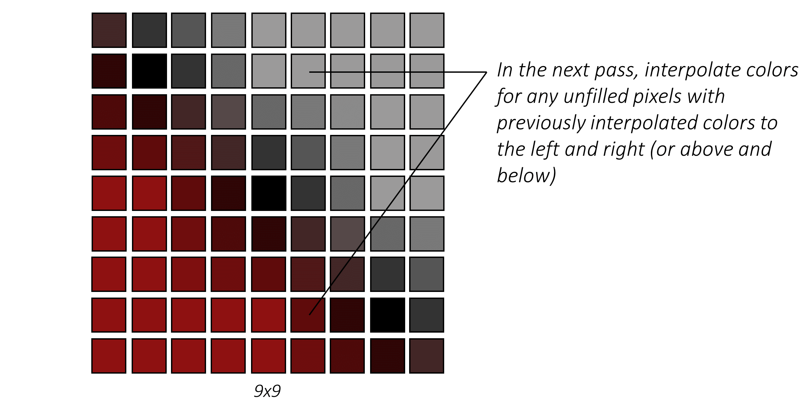

Upsampling the low-resolution Samurai image using bilinear interpolation yields a result that is smoother than what we achieved using nearest neighbor interpolation, because there is a more natural transition between pixels. 

Alternatively, you can perform cubic interpolation using 4 known pixels (i.e., 2 on each side). This would be **_bicubic_ upsampling**. As you can imagine, the result is even smoother because we're using more data to perform the interpolation.

[This Wikimedia image](https://commons.wikimedia.org/wiki/File:Comparison_of_1D_and_2D_interpolation.svg) provides a nice snapshot of these interpolation methods.

I would guess that if you're viewing a lower-resolution video on a higher-resolution screen – with the VLC media player, for example – you are seeing individual frames of the video upscaled using either bilinear or bicubic interpolation.

There are other, more advanced upsampling methods such as [Lanczos](https://en.wikipedia.org/wiki/Lanczos_resampling), but my understanding of them is fairly limited. 

### Neural Super-Resolution

In contrast to more "naive" image upsampling, the goal of super-resolution *is* to **create high-resolution, high-fidelity, aesthetically pleasing, plausible images** from the low-resolution version. 

When an image is reduced to a lower resolution, finer details are irretrievably lost. Similarly, **upscaling to a higher resolution requires the _addition_ of new information**. 

As a human, you may be able to visualize what an image might look like at a greater resolution – you might say to yourself, "this blurry mess in this corner would resolve into individual strands of hair", or "that sand-coloured patch might actually be sand and would appear... granular". To manually create such an image yourself, however, would require a certain level of artistry and would no doubt be extremely painstaking. The goal here, in this tutorial, would be to **train a neural network to perform this task**.

A neural network trained for super-resolution might recognize, for instance, that the black diagonal line in our low-resolution patch from above would need to be reproduced as a smooth but sharp black diagonal in the upscaled image.

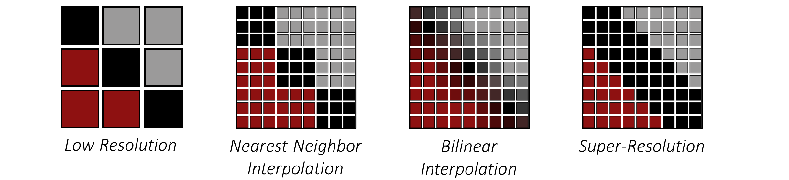

While neurally super-resolving an image may not be practical (or even necessary) for more mundane tasks, it is already being applied _today_. If you're playing a videogame with [NVIDIA DLSS](https://en.wikipedia.org/wiki/Deep_learning_super_sampling), for example, what's on your screen is being rendered (at lower cost) at a lower resolution and then neurally hallucinated into a larger but crisp image, as if you rendered it at this higher resolution in the first place. The day may not be far when your favorite video player will automatically upscale a movie to 4K as it plays on your humongous TV. 

As stated at the beginning of this tutorial, we will be training two generative neural models – the **SRResNet** and the **SRGAN**. 

Both networks will aim to _quadruple_ the dimensions of an image i.e. increase the number of pixels by 16x!

The low-resolution Samurai image super-resolved with the SRResNet is comparable in quality to the original high-resolution version.

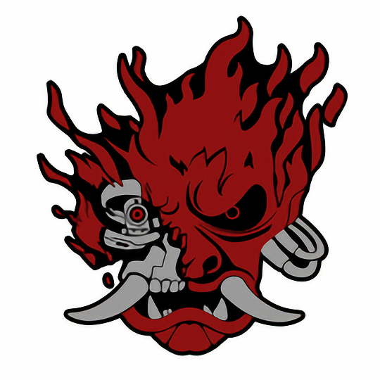

And so is the low-resolution Samurai image super-resolved with the SRGAN.

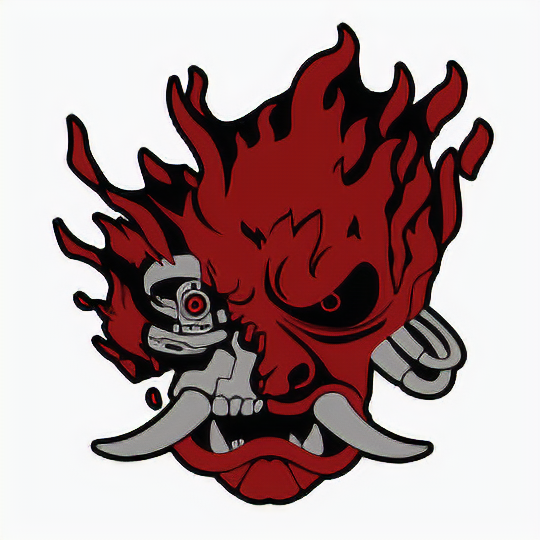

With the Samurai image, I'd say the SRResNet's result looks better than the SRGAN's. However, this might be because it's a relatively simple image with plain, solid colours – the SRResNet's weakness for producing overly smooth textures works to its advantage in this instance. 

In terms of the ability to create photorealistic images with fine detail, the SRGAN greatly outperforms the SRResNet because of its adversarial training, as evidenced in the various examples peppered throughout this tutorial.

### Residual (Skip) Connections

Generally, **deeper neural networks are more capable** – but only up to a point. It turns out that adding more layers will improve performance but after a certain threshold is reached, **performance will *degrade***. 

This degradation is not caused by overfitting the training data – training metrics are affected as well. Nor is it caused by vanishing or exploding gradients, which you might expect with deep networks, because the problem persists despite normalizing initializations and layer outputs. 

To address this relative unoptimizability of deeper neural networks, in a [seminal 2015 paper](https://arxiv.org/abs/1512.03385), researchers introduced **_skip_ connections** – shortcuts that allow information to flow, unchanged, across an intervening operation. This information is added, element-wise, to the output of the operation.

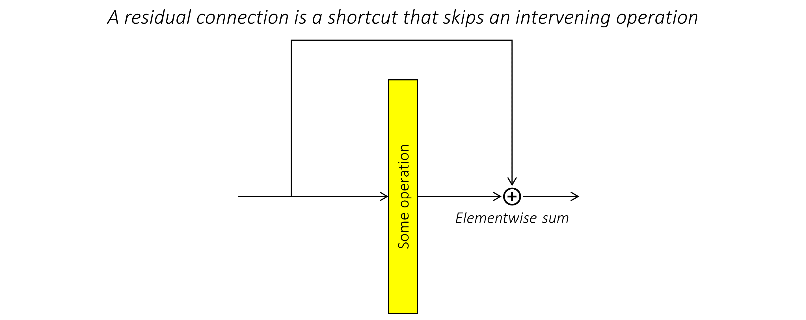

Such a connection need not occur across a single layer. You can create a shortcut across a group of successive layers.

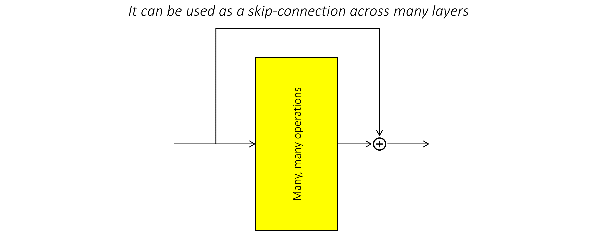

Skip connections allow intervening layers to **learn a residual mapping instead of learning the unreferenced, desired function in its entirety** – i.e., it would need to model only the changes that must be made to the input to produce the desired output. Thus, while the final result might be the same, what we want these layers to learn has been fundamentally changed.

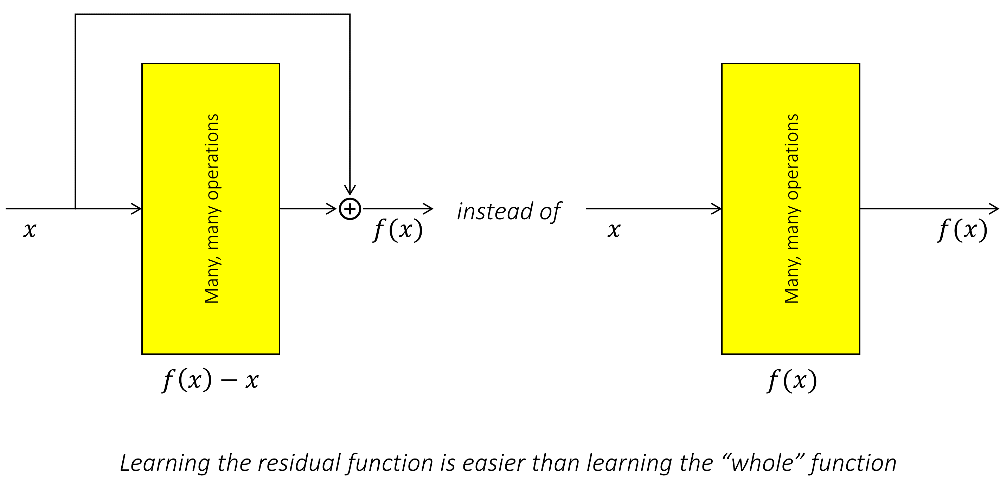

**Learning the residual mapping is significantly easier**. Consider, for example, the extreme case of having a group of non-linear layers learn the _identity_ mapping. While this may appear to be a simple task at first glance, its solution – i.e. the weights of these layers that linearly transform the input in such a way that applying a non-linear activation produces that same input – isn't obvious, and approximating it is not trivial. In contrast, the solution to learning its residual mapping, which is simply a _zero function_ (i.e., no changes to the input), *is* trivial – the weights must simply be driven to zero. 

It turns out that this particular example _isn't_ as extreme as we think because **deeper layers in a network do learn something not completely unlike the identity function** because only small changes are made to the input by these layers. 

Skip connections allow you to train very deep networks and unlock significant performance gains. It is no surprise that they are used in both the SRResNet (aptly named the Super-Resolution _Residual_ Network) and the Generator of the SRGAN. In fact, you'd be hard-pressed to find a modern network without them. 

### Sub-Pixel Convolution

How is upscaling handled in CNNs? This isn't a task specific to super-resolution, but also to applications like semantic segmentation where the more "global" feature maps, which are by definition at a lower resolution, must be upsampled to the resolution you want to perform the segmentation at. 

A common approach is to **perform bilinear or bicubic upsampling to the target resolution, and _then_ apply convolutions** (which must be learned) to produce a better result. In fact, earlier networks for super-resolution did exactly this – upscale the low-resolution image at the very beginning of the network and then apply a series of convolutional layers in the high-resolution space to produce the final super-resolved image. 

Another popular method is **transposed convolution**, which you may be familiar with, where whole convolutional kernels are applied to single pixels in the low-resolution image and the resulting multipixel patches are combined at the desired stride to produce the high-resolution image. It's basically **the reverse of the usual convolution process**.

**Subpixel convolution** is an alternative approach that involves applying regular convolutions to the low-resolution image such that **the new pixels that we require are created in the form of additional channels**. 

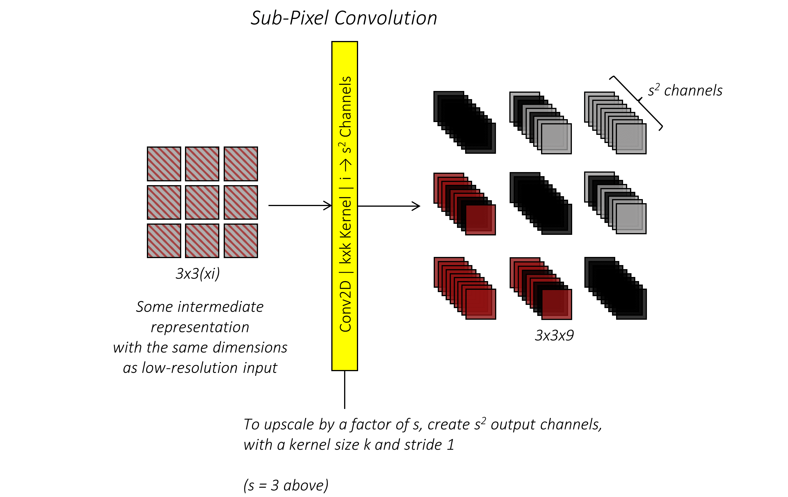

In other words, **if you want to upsample by a factor $s$**, the $s^2$ new pixels that must be created for each pixel in the low-resolution image are produced by the convolution operation in the form of **$s^2$ new channels** at that location. You may use any kernel size $k$ of your choice for this operation, and the low-resolution image can have any number of input channels $i$.

These channels are then rearranged to yield the high-resolution image, in a process called the **pixel shuffle**.

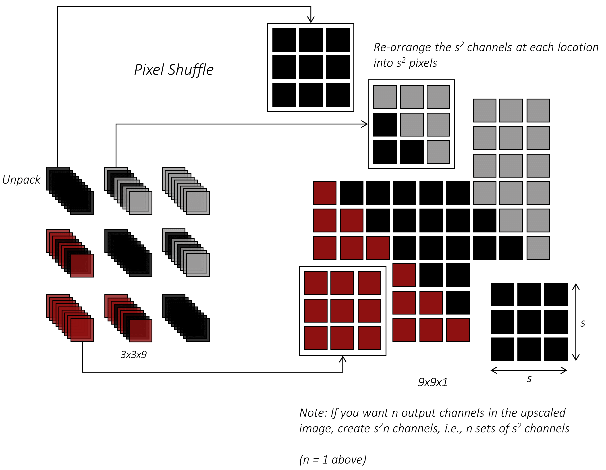

In the above example, there's only one output channel in the high-resolution image. **If you require $n$ output channels, simply create $n$ sets of $s^2$ channels**, which can be shuffled into $n$ sets of $s * s$ patches at each location. 

In the rest of the tutorial, we will the pixel-shuffle operation as follows –

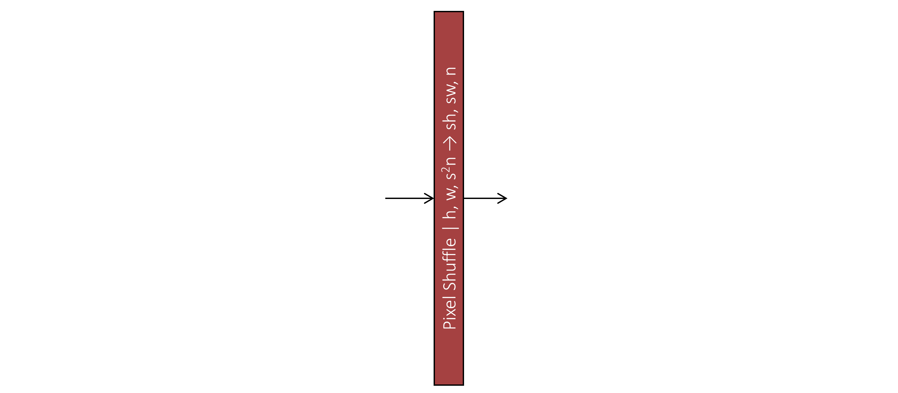

As you can imagine, **performing convolutions in the low-resolution space is more efficient than doing so at a higher resolution**. Therefore, the subpixel convolution layer is often at the very end of the super-resolution network, *after* a series of convolutions have already been applied to the low-resolution image. 

### Minimizing Loss – a refresher

Let's stop for a moment to examine _why_ we construct loss functions and minimize them. You probably already know all of this, but I think it would help to go over these concepts again because they are key to understanding how GANs are trained. 

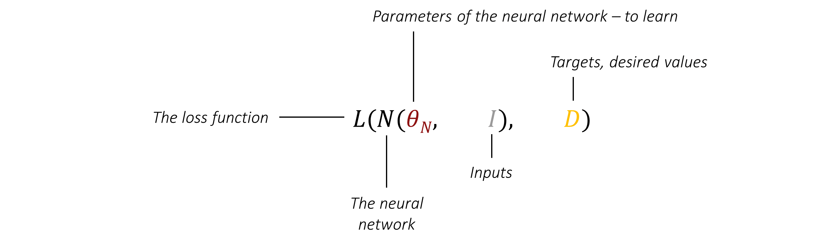

- A **loss function** $L$ is basically a function that quantifies how _different_ the outputs of our network $N$ are from their desired values $D$. 
  
- Our neural network's outputs $N(θ_N, I)$ are the outputs generated by the network with its current parameter set $θ_N$ when provided an input $I$.
  
- We say _desired_ values $D$, and not gold values or labels, because the values we desire are not necessarily the truth, as we will see later.
  
- The goal then would be to **minimize the loss function**, which we do by changing the network's parameters $θ_N$ in a way that drives its ouptuts $N(θ_N, I)$ towards the desired values $D$. 

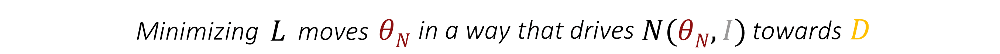

Keep in mind that the change in the parameters $θ_N$ is not a consequence of minimizing the loss function $L$. Rather, the minimization of the loss function $L$ is a consequence of changing the parameters $θ_N$ in a particular way. Above, I say "Minimizing $L$ *moves* $θ_N$..." simply to indicate that *choosing* to minimize a certain loss function $L$ implies these particular changes to $θ_N$.

_How_ the direction and magnitude of the changes to $θ_N$ are decided is secondary to this particular discussion, but in the interest of completeness – 

- Gradients of the loss function $L$ with respect to the parameters $θ_N$, i.e. $\frac{∂L}{∂θ_N}$ are calculated, by propagating gradients back through the network using the chain rule of differentiation, in a process known as *backpropagation*.
  
- The parameters $θ_N$ are moved in a direction opposite to the gradients $\frac{∂L}{∂θ_N}$ by a magnitude proportional to the magnitude of the gradients $\frac{∂L}{∂θ_N}$ and a step size $lr$ known as the learning rate, thereby descending along the surface of the loss function, in a process known as *gradient descent*.

To conclude, the important takeaway here is that, for a network $N$ given an input $I$, by choosing a suitable loss function $L$ and desired values $D$, it is possible to manipulate all parameters $θ_N$ upstream of the loss function in a way that drives outputs of $N$ closer to $D$. 

Depending upon our requirements, we may choose to manipulate only a subset $θ_n$ of all parameters $θ_N$, by freezing the other parameters $θ_{N-n}$, thereby **training only a subnetwork $n$ in the whole network $N$**, in a way that drives outputs of the subnetwork $n$ in a way which, in turn, drives outputs of the whole network $N$ closer to desired values $D$. 

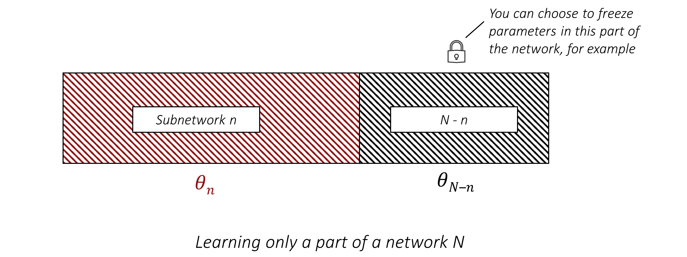

You may have already done this before in transfer learning applications – for instance, fine-tuning only the final layers $n$ of a large pretrained CNN or Transformer model $N$ to adapt it to a new task. We will do something similar later on, but in an entirely different context.

### The Super-Resolution ResNet (SRResNet)

The SRResNet is a **fully convolutional network designed for 4x super-resolution**. As indicated in the name, it incorporates residual blocks with skip connections to increase the optimizability of the network despite its significant depth. 

The SRResNet is trained and used as a standalone network, and as you will see soon, provides a **nice baseline for the SRGAN** – for both comparision and initialization.

#### The SRResNet Architecture

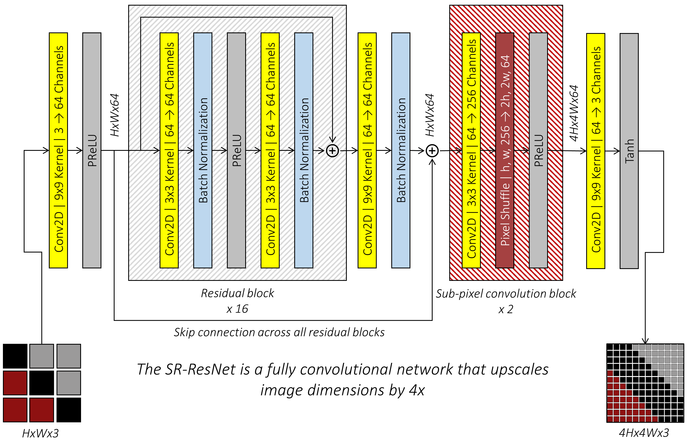

The SRResNet is composed of the following operations –

- First, the low resolution image is convolved with a large kernel size $9\times9$ and a stride of $1$, producing a feature map at the same resolution but with $64$ channels. A parametric *ReLU* (*PReLU*) activation is applied.
  
- This feature map is passed through $16$ **residual blocks**, each consisting of a convolution with a $3\times3$ kernel and a stride of $1$, batch normalization and *PReLU* activation, another but similar convolution, and a second batch normalization. The resolution and number of channels are maintained in each convolutional layer.
  
- The result from the series of residual blocks is passed through a convolutional layer with a $3\times3$ kernel and a stride of $1$, and batch normalized. The resolution and number of channels are maintained. In addition to the skip connections in each residual block (by definition), there is a larger skip connection arching across all residual blocks and this convolutional layer.
  
- $2$ **subpixel convolution blocks**, each upscaling dimensions by a factor of $2$ (followed by *PReLU* activation), produce a net 4x upscaling. The number of channels is maintained.
  
- Finally, a convolution with a large kernel size $9\times9$ and a stride of $1$ is applied at this higher resolution, and the result is *Tanh*-activated to produce the **super-resolved image with RGB channels** in the range $[-1, 1]$.

If you're wondering about certain specific numbers above, don't worry. As is often the case, they were likely decided either empirically or for convenience by the authors and in the other works they referenced in their paper. 

#### The SRResNet Update

Training the SRResNet, like any network, is composed of a series of updates to its parameters. What might constitute such an update?

Our training data will consist of high-resolution (gold) images, and their low-resolution counterparts which we create by 4x-downsampling them using bicubic interpolation. 

In the forward pass, the SRResNet produces a **super-resolved image at 4x the dimensions of the low-resolution image** that was provided to it. 

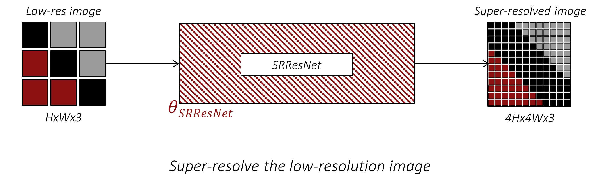

We use the **Mean-Squared Error (MSE) as the loss function** to compare the super-resolved image with this original, gold high-resolution image that was used to create the low-resolution image.

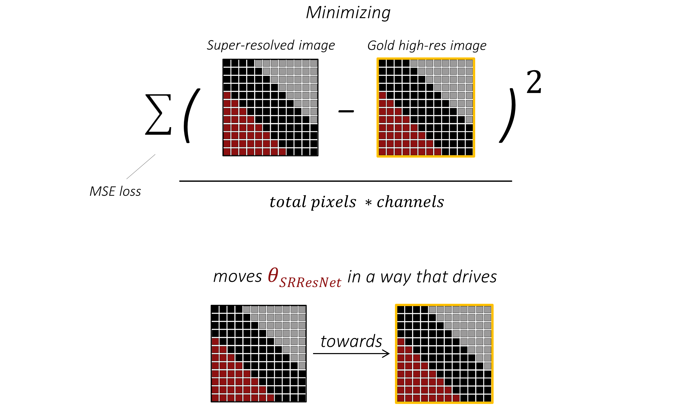

Choosing to minimize the MSE between the super-resolved and gold images means we will change the parameters of the SRResNet in a way that, if given the low-resolution image again, it will **create a super-resolved image that is closer in appearance to the original high-resolution version**. 

The MSE loss is a type of ***content* loss**, because it is based purely on the contents of the predicted and target images. 

In this specific case, we are considering their contents in the ***RGB space*** – we will discuss the significance of this soon.

### The Super-Resolution Generative Adversarial Network (SRGAN)

The SRGAN consists of a **Generator** network and a **Discriminator** network. 

The goal of the Generator is to learn to super-resolve an image realistically enough that the Discriminator, which is trained to identify telltale signs of such artificial origin, can no longer reliably tell the difference. 

Both networks are **trained in tandem**. 

The Generator learns not only by minimizing a content loss, as in the case of the SRResNet, but also by _spying_ on the Discriminator's methods. 

If you're wondering, _we_ are the mole in the Discriminator's office! By providing the Generator access to the Discriminator's inner workings in the form of the gradients produced therein when backpropagating from its outputs, the Generator can adjust its own parameters in a way that alter the Discriminator's outputs in its favour. 

And as the Generator produces more realistic high-resolution images, we use these to train the Disciminator, improving its disciminating abilities.

#### The Generator Architecture

The Generator is **identical to the SRResNet** in architecture. Well, why not? They perform the same function. This also allows us to use a trained SRResNet to initialize the Generator, which is a huge leg up. 

#### The Discriminator Architecture

As you might expect, the Discriminator is a convolutional network that functions as a **binary image classifier**.

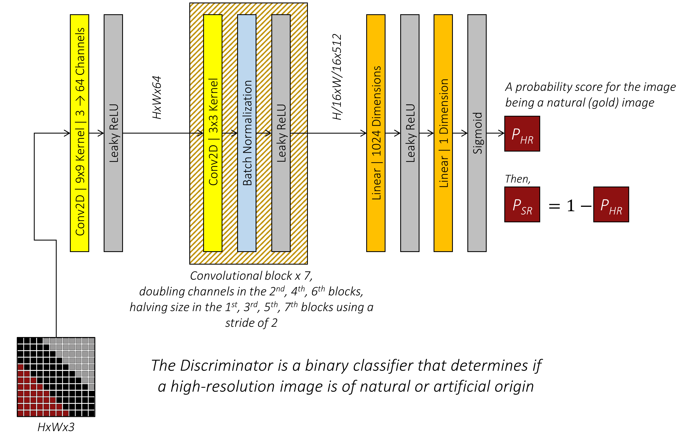

It is composed of the following operations –

- The high-resolution image (of natural or artificial origin) is convolved with a large kernel size $9\times9$ and a stride of $1$, producing a feature map at the same resolution but with $64$ channels. A leaky *ReLU* activation is applied.
  
- This feature map is passed through $7$ **convolutional blocks**, each consisting of a convolution with a $3\times3$ kernel, batch normalization, and leaky *ReLU* activation. The number of channels is doubled in even-indexed blocks. Feature map dimensions are halved in odd-indexed blocks using a stride of $2$.
  
- The result from this series of convolutional blocks is flattened and linearly transformed into a vector of size $1024$, followed by leaky *ReLU* activation.
  
- A final linear transformation yields a single logit, which can be converted into a probability score using the *Sigmoid* activation function. This indicates the **probability of the original input being a natural (gold) image**.

#### Interleaved Training

First, let's describe how the Generator and Discriminator are trained in relation to each other. Which do we train first? 

Well, neither is fully trained well before the other – they are both trained *together*.

Typically, any GAN is **trained in an interleaved fashion**, where the Generator and Discriminator are alternately trained for short periods of time.

In this particular paper, each component network is updated just once before making the switch.

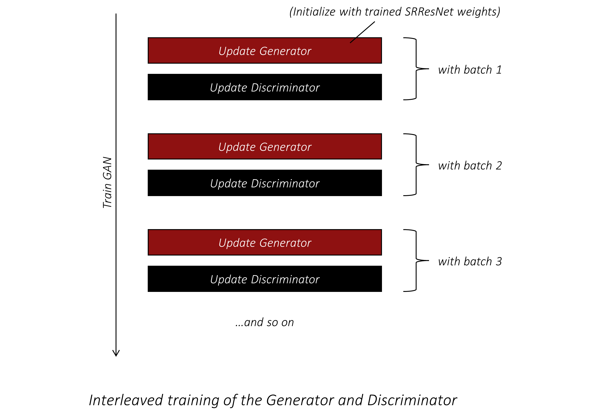

In other GAN implementations, you may notice there are $k$ updates to the Discriminator for every update to the Generator, where $k$ is a hyperparameter that can be tuned for best results. But often, $k=1$.

#### The Discriminator Update

It's better to understand what constitutes an update to the Discriminator before getting to the Generator. There are no surprises here – it's exactly as you would expect. 

Since the Discriminator will learn to tell apart natural (gold) high-resolution images from those produced by Generator, it is provided both gold and super-resolved images with the corresponding labels ($HR$ vs $SR$) during training.

For example, in the forward pass, the Discriminator is provided with a gold high-resolution image and it produces a **probability score $P_{HR}$ for it being of natural origin**. 

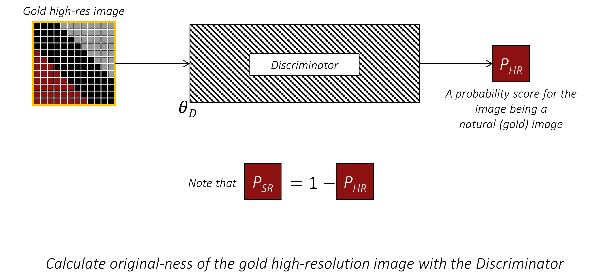

We desire the Discriminator to be able to correctly identify it as a gold image, and for $P_{HR}$ to be as high as possible. We therefore minimize the **binary cross-entropy loss** with the correct ($HR$) label.

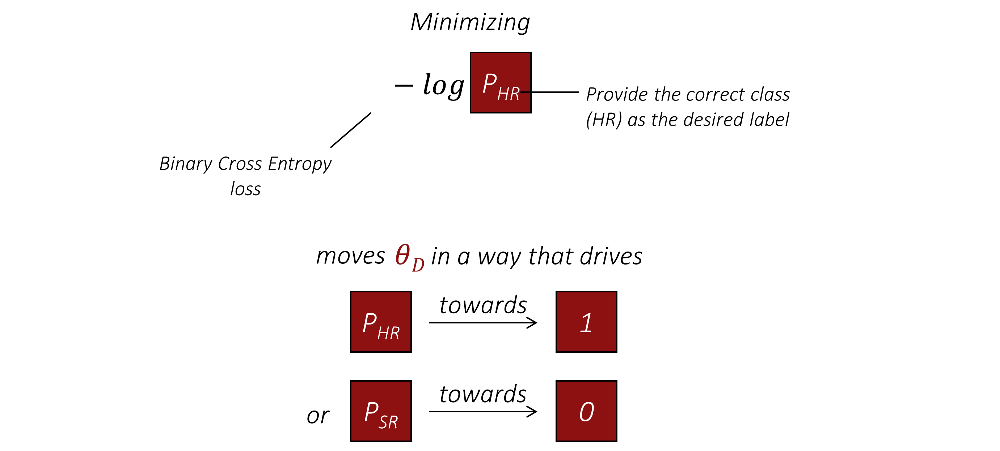

Choosing to minimize this loss will change the parameters of the Discriminator in a way that, if given the gold high-resolution image again, it will **predict a higher probability $P_{HR}$ for it being of natural origin**. 

Similarly, in the forward pass, the Discriminator is provided with the super-resolved image that the Generator (in its current state) created from the downsampled low-resolution version of the original high-resolution image, and the Discriminator produces a **probability score $P_{HR}$ for it being of natural origin**. 

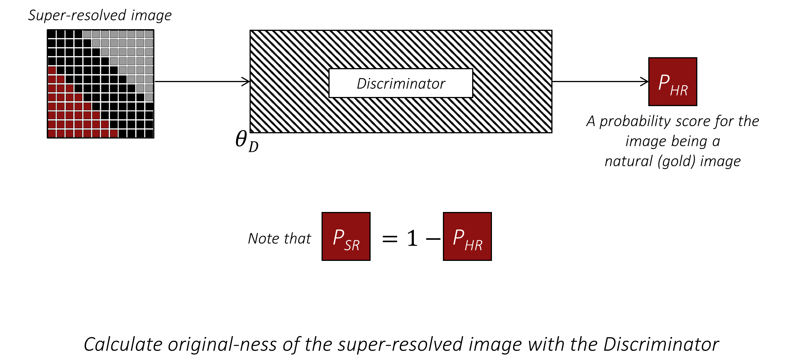

We desire the Discriminator to be able to correctly identify it as a super-resolved image, and for $P_{HR}$ to be as low as possible. We therefore minimize the **binary cross-entropy loss** with the correct ($SR$) label.

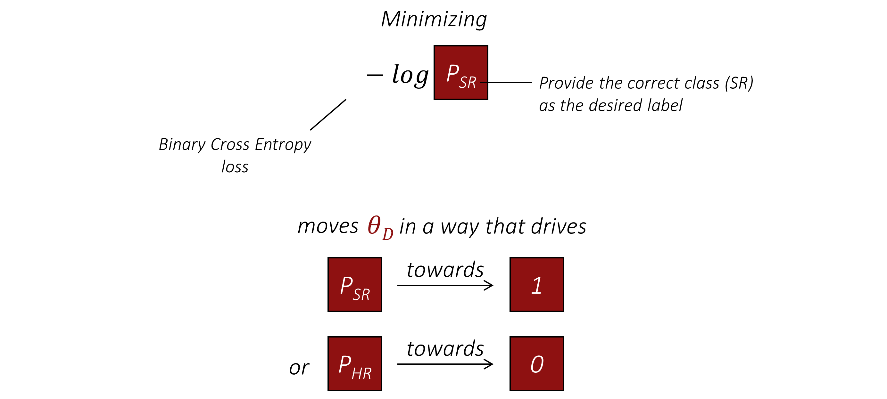

Choosing to minimize this loss will change the parameters of the Discriminator in a way that, if given the super-resolved image again, it will **predict a lower probability $P_{HR}$ for it being of natural origin**. 

The training of the Discriminator is fairly straightforward, and isn't any different from how you would expect to train any image classifier.

Now, let's look at what constitutes an update to the Generator.

#### A Better Content Loss

The **MSE-based content loss in the RGB space**, as used with the SRResNet, is a staple in the image generation business. 

But it has its drawbacks – it **produces overly smooth images** without the fine detail that is required for photorealism. You may have already noticed this in the results of the SRResNet in the various examples in this tutorial. And it's easy to see why.

When super-resolving a low-resolution patch or image, there are often multiple closely-related possibilities for the resulting high-resolution version. In other words, a small blurry patch in the low-resolution image can resolve itself into a manifold of high-resolution patches that would each be considered a valid result. 

Imagine, for instance, that a low-resolution patch would need to produce a hatch pattern with blue diagonals with a specific spacing at a higher resolution in the RGB space. There are multiple possiblities for the exact positions of these diagonal lines.

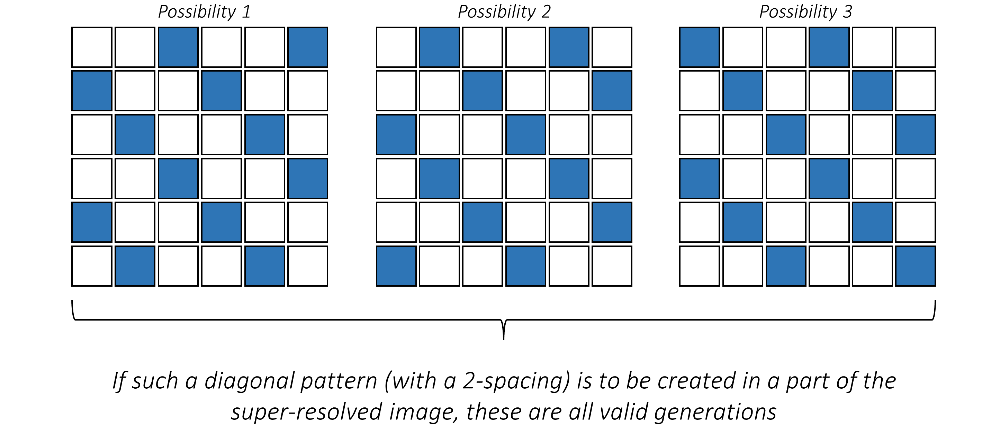

Any one of these would be considered a satisfying result. Indeed, the natural high-resolution image *will* contain one of them. 

But a network trained with content loss in the RGB space, like the SRResNet, would be quite reluctant to produce such a result. Instead, it opts to produce something that is essentially the ***average* of the manifold of finely detailed high-resolution possibilities.** This, as you can imagine, contains little or no detail because they have all been averaged out! But it *is* a safe prediction because the natural or ground-truth patch it was trained with can be any one of these possibilities, and producing any *other* valid possibility would result in a very high MSE.

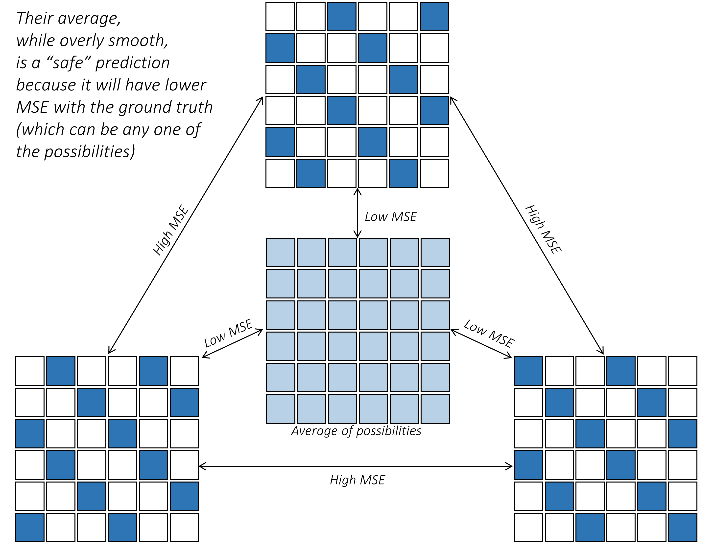

